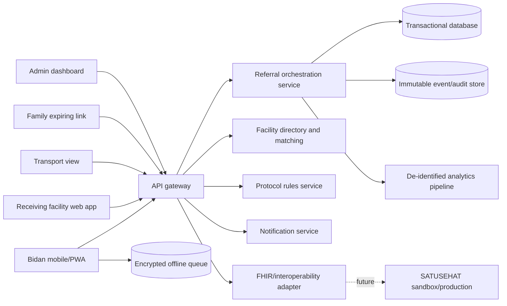

# IbuRujuk Product Requirements Document

**Version:** 1.0  
**Status:** Hackathon MVP specification; not approved for clinical deployment  
**Date:** 16 July 2026  
**Product owner:** TBD  
**Clinical owner:** Must be appointed before any field pilot  
**Primary market:** Indonesian maternal referral network  
**Initial pathway:** Suspected pre-eclampsia and eclampsia-related referral  

---

## 1. Executive summary

IbuRujuk is an offline-first, closed-loop maternal emergency referral coordination platform. It helps a bidan convert a referral decision into an accepted destination, coordinated transfer, complete clinical handover, confirmed arrival, and feedback from the receiving facility.

IbuRujuk does **not** diagnose pre-eclampsia, replace antenatal care, replace a bidan, or compete with clinical screening tools. Pre-eclampsia is the first referral pathway because it is a major contributor to maternal mortality in Indonesia and because delays between recognition and definitive care can be dangerous.

The initial product serves six connected participants:

1. The referring bidan or primary-care clinician.
2. A dispatcher or designated responder at the receiving facility.
3. The receiving clinical team.
4. A transport or ambulance coordinator.
5. The patient and family.
6. A Dinas Kesehatan or network administrator reviewing de-identified operational performance.

The product is differentiated by its operational endpoint. PE-Detector and similar applications answer, “Could this patient be at risk?” SEHATI supports maternal records, risk monitoring, TeleCTG, and specialist consultation. IbuRujuk answers, “How do we get this patient to an appropriate facility that has acknowledged the case, without losing information or time?”

### Product promise

> No urgent maternal referral should disappear between the bidan’s decision and the receiving facility’s handover.

### Primary success metric

**Median time from the bidan’s recorded referral decision to acknowledgement by an appropriate receiving facility.**

### Hackathon outcome

The MVP must demonstrate one complete, synthetic pre-eclampsia referral across a bidan interface, receiving-facility interface, transport timeline, family explanation, and operational dashboard. It must work without physical medical hardware and must clearly label facility capacity and patient data as simulated.

---

## 2. Background and evidence

### 2.1 Why this problem matters

Kementerian Kesehatan reported in April 2026 that Indonesia’s maternal mortality ratio remained approximately 140 per 100,000 live births and that pre-eclampsia and eclampsia represented approximately 25% of maternal deaths, making them the second-largest reported cause. Kemenkes is strengthening technology-supported early detection, including distribution of ultrasound devices to puskesmas and exploration of IoMT and AI-assisted screening.[^1]

Pre-eclampsia is a hypertensive disorder that usually develops after 20 weeks of pregnancy. It may progress to eclampsia, seizures, HELLP syndrome, organ damage, placental abruption, preterm birth, fetal growth restriction, and maternal or fetal death. Some patients have severe headache, visual disturbance, upper-abdominal pain, nausea, swelling, or breathing difficulty, while others may initially have few obvious symptoms.[^2]

Early recognition alone does not guarantee timely care. A 2026 WHO review of Indonesian reproductive, maternal, newborn, child, and adolescent health services identified fragmented maternal histories, referral delays, insufficient antenatal care, workload constraints, and uneven local capacity.[^3] A 2024 qualitative study of Indonesian midwives described difficulties across referral consent, pre-referral care, transport, hospital admission, hospital refusal, and handover.[^4]

### 2.2 Bidan are trained professionals

IbuRujuk must be built around, not against, bidan expertise. Kemenkes’ integrated ANC curriculum for bidan includes early identification of pregnancy problems and complications, collaboration, case-appropriate referral, and ANC documentation.[^5] A 2025 Kemenkes curriculum also covers team-based early detection of pre-eclampsia risks and complications using Buku KIA and standard protocols according to each professional’s authority.[^6]

The product therefore supports workflow reliability and system coordination. It must never imply that a bidan cannot recognize pregnancy danger signs without an app.

### 2.3 Competitive context

#### PE-Detector

Universitas Airlangga’s PE-Detector was designed for early pre-eclampsia risk recognition. Its public description combines subjective information such as maternal age, parity, medical history, hypertension, anaemia, and ANC adherence with objective calculations such as BMI, Mean Arterial Pressure, and the Roll-Over Test.[^7]

PE-Detector is upstream of IbuRujuk. Its risk result could eventually become one verified input to a referral case, but IbuRujuk must not reproduce its screening claim as the central innovation.

#### SEHATI and TeleCTG

SEHATI publicly describes an integrated maternal platform with ANC/INC/PNC recording, cohort reporting, maternal risk detection, a pregnant-woman application, TeleCTG, a dashboard, and a 24-hour specialist consultation centre. TeleCTG monitors fetal heart rate, uterine contractions, and fetal movement.[^8]

IbuRujuk is not a replacement for fetal monitoring or specialist consultation. Its narrow responsibility is operational referral execution: destination matching, acknowledgement, escalation, transport, handover, arrival confirmation, and referral feedback.

### 2.4 Product opportunity

Existing digital products can help identify risk or support consultation. The gap IbuRujuk addresses is the transition between facilities and people. Its unit of value is not a risk score; it is a successfully completed referral episode with a traceable timeline.

---

## 3. Problem statement

When a bidan identifies a pregnant patient who may need referral, the following failures can occur:

- The family does not understand the urgency or delays consent.
- Previous measurements and pregnancy history are fragmented.
- The referral message is incomplete or sent through informal channels.
- The first hospital contacted cannot accept the patient.
- The bidan must repeatedly call facilities while continuing patient care.
- Facility capability or operational availability is unclear.
- Transport is delayed or its status is unknown.
- The receiving team does not have a concise pre-arrival handover.
- The referring bidan does not know whether the patient arrived.
- Health administrators cannot distinguish where delays occurred.

### Root problem

Maternal referral is a multi-party workflow, but it is often treated as a document or phone call. There is no guaranteed closed loop connecting the referral decision, destination acknowledgement, patient transfer, arrival, handover, and feedback.

### “Three delays” framing

IbuRujuk addresses three operational delays without claiming to solve every cause:

1. **Decision delay:** patient or family hesitation, limited understanding, and consent documentation.
2. **Travel delay:** unclear destination, transport coordination, distance, and ETA.
3. **Care-entry delay:** facility non-response, refusal, missing information, and incomplete handover.

---

## 4. Product vision and principles

### Vision

Create a reliable maternal referral network in which every participant can see what must happen next, who owns the next action, and whether the patient has reached appropriate care.

### Product principles

1. **Bidan-led:** The bidan makes and records the professional decision. The system supports rather than overrides it.
2. **No-delay safety:** Using the application must never be a prerequisite for emergency action.
3. **Closed loop:** Sending a referral is not completion. Arrival and handover are completion.
4. **Minimum necessary data:** Show each participant only the information required for their task.
5. **Offline tolerant:** The referring workflow must remain usable during unstable connectivity.
6. **Explainable rules:** Any safety flag must show the triggering data and the protocol version.
7. **No hidden downgrading:** No AI or algorithm may lower the urgency selected by a clinician.
8. **Interoperable by design:** Use standard identifiers and FHIR-compatible mappings even when the MVP uses simulated integration.
9. **Operational truth:** Capacity, response, and transport information must show its source and last-updated time.
10. **Respectful communication:** Family-facing messages must inform without blaming, frightening, or making unsupported promises.

---

## 5. Goals and non-goals

### 5.1 Product goals

- Reduce the time between referral decision and receiving-facility acknowledgement.
- Improve completeness and consistency of maternal referral handovers.
- Make referral ownership and next actions visible.
- Support safe escalation when a destination does not respond or cannot receive the patient.
- Provide the family with a clear explanation, destination, and transport instructions.
- Confirm departure, arrival, handover, and receiving-facility feedback.
- Preserve a complete audit trail of actions and timestamps.
- Produce operational analytics about where referral delays occur.
- Function in low-connectivity conditions without requiring proprietary medical hardware.
- Provide an architecture that can later integrate with SATUSEHAT and existing maternal systems.

### 5.2 Non-goals

IbuRujuk will not:

- Diagnose, confirm, or rule out pre-eclampsia.
- Replace the bidan, doctor, Buku KIA, ANC, or local referral protocol.
- Produce a proprietary pre-eclampsia risk score in the MVP.
- Recommend medications, doses, stabilization procedures, or delivery decisions.
- Interpret CTG, ultrasound, laboratory images, or medical images.
- Guarantee hospital beds, operating rooms, blood products, specialists, or transport.
- Replace emergency telephone services or direct professional communication.
- Submit real referrals during the hackathon.
- Use real patient data in the demonstration.
- Process BPJS claims or payments in the MVP.
- Integrate with production SATUSEHAT during the hackathon.
- Measure success through maternal mortality reduction during an early pilot; that requires a much larger and longer evaluation.

---

## 6. Users, roles, and jobs to be done

### 6.1 Referring bidan

**Context:** Works at a pustu, puskesmas, clinic, or independent practice; may face a heavy workload and unstable connectivity.

**Jobs:**

- Capture the minimum referral information quickly.
- Make and document the referral decision.
- Find an appropriate destination.
- Obtain acknowledgement without repeatedly calling multiple facilities.
- Explain the referral to the family.
- Know whether the patient arrived and what feedback was received.

**Success:** The referral is accepted, the patient departs, and the receiving facility confirms handover.

### 6.2 Receiving-facility dispatcher

**Context:** Monitors incoming cases for a hospital, PONEK team, emergency department, or regional referral centre.

**Jobs:**

- Triage the referral request operationally.
- See the reason, urgency, requested capability, and ETA.
- Accept, decline with a structured reason, request information, or redirect.
- Assign a receiving unit or contact.

**Success:** Appropriate cases are acknowledged rapidly and the clinical team is prepared before arrival.

### 6.3 Receiving clinician

**Jobs:**

- Review the pre-arrival maternal summary.
- Record acknowledgement and handover completion.
- Send concise feedback to the referring bidan.

### 6.4 Transport coordinator or driver

**Jobs:**

- Receive pickup and destination details without unnecessary clinical information.
- Update assigned, arrived-at-origin, departed, and arrived-at-destination statuses.
- Share an ETA without exposing patient information publicly.

### 6.5 Patient and family

**Jobs:**

- Understand why referral is recommended.
- Know the destination, travel plan, required documents, and contact person.
- Ask questions and have consent or refusal documented by the authorized health worker.

### 6.6 Dinas Kesehatan or network administrator

**Jobs:**

- Maintain facility directory and capability metadata.
- Review de-identified referral delays and decline reasons.
- Identify recurring bottlenecks without accessing unnecessary clinical detail.
- Manage users, roles, facilities, and protocol versions.

---

## 7. Primary user stories

### Referring bidan

- As a bidan, I want to create an urgent referral in under three minutes so that documentation does not delay care.
- As a bidan, I want the system to show which required information is missing so that the receiving team can act.
- As a bidan, I want to see why a safety flag appeared so that I can verify the underlying measurement.
- As a bidan, I want appropriate facilities ranked by capability and travel time so that I do not call unsuitable destinations.
- As a bidan, I want to retain final authority over referral urgency and destination.
- As a bidan, I want an alternative destination suggested after a decline or timeout.
- As a bidan, I want to know when the patient arrives so the referral is not lost.

### Receiving facility

- As a dispatcher, I want a concise structured referral rather than an unstructured chat message.
- As a dispatcher, I want to request a missing value without rejecting the entire referral.
- As a dispatcher, I want to decline with a structured operational reason so the sender can act quickly and administrators can improve capacity.
- As a clinician, I want a pre-arrival handover summary that identifies the sender and timestamps every observation.

### Patient and family

- As a family member, I want a plain-language explanation of why the bidan recommends referral so that I can make a timely informed decision.
- As a patient, I want my information visible only to authorized participants.

### Administrator

- As an administrator, I want to see where time was spent in the referral journey so that I can distinguish decision, travel, and admission delays.

---

## 8. Product scope and prioritization

Priority definitions:

- **P0:** Required for the hackathon’s complete end-to-end story.
- **P1:** Important for a pilot-ready prototype.
- **P2:** Future enhancement.

### 8.1 P0 hackathon scope

- Role-based demonstration for bidan, receiving facility, transport, and administrator.
- Synthetic patient and facility data only.
- Create and edit a maternal referral case.
- Record gestational context, measurements, symptoms, relevant history, and bidan decision.
- Protocol-based safety flag with visible triggering facts.
- Facility directory with simulated capabilities, availability, distance, and last update.
- Send referral request.
- Accept, decline with reason, or request more information.
- Suggest the next eligible facility after decline or timeout.
- Generate structured referral handover.
- Record family explanation and consent status.
- Simulate transport assignment and ETA.
- Confirm arrival and handover.
- Display complete event timeline.
- Display operations dashboard and referral delay decomposition.
- Demonstrate an offline-created draft and later synchronization.

### 8.2 P1 pilot scope

- Real facility accounts and verified capability directory.
- Push/SMS/approved messaging notifications.
- Secure bidan and dispatcher authentication.
- Configurable response timers by urgency and local protocol.
- Encrypted offline storage.
- Facility operating-status verification workflow.
- Duplicate-patient and duplicate-referral detection.
- Production-grade audit export.
- Patient/family read-only web link with expiring token.
- Device and user session management.
- Clinical rule governance and version approval.
- Sandbox SATUSEHAT interoperability proof of concept.
- Usability testing with bidan and receiving staff.

### 8.3 P2 scale scope

- Integration adapters for existing RME, PE-Detector-like tools, and maternal platforms.
- Regional ambulance-dispatch integration.
- Additional pathways such as obstetric haemorrhage, sepsis, prolonged labour, and neonatal emergencies, each separately governed and validated.
- OCR-assisted extraction from Buku KIA, always requiring human verification.
- Voice-assisted data capture for accessibility and speed.
- Local-language family explanations reviewed by community representatives.
- Capacity forecasting based on de-identified operational data.
- Advanced network planning and referral simulation.

---

## 9. End-to-end workflows

### 9.1 Standard urgent referral

1. Bidan signs in and selects **Create referral**.
2. Bidan finds or creates the patient record.
3. Bidan enters pregnancy context and current observations.
4. The app validates formatting, timestamps, and missing critical fields.
5. The protocol engine displays any safety flags and their triggers.
6. Bidan records the clinical concern, urgency, and decision to refer.
7. The app generates required facility capabilities from the selected pathway; the bidan can edit them.
8. Eligible facilities are ranked using operational—not diagnostic—criteria.
9. Bidan selects a facility and sends the request.
10. Receiving facility acknowledges, requests information, accepts, declines, or redirects.
11. If accepted, the family explanation and transport workflow are completed.
12. Transport status advances from assigned to in transit to arrived.
13. Receiving facility confirms arrival and clinical handover.
14. Receiving facility optionally sends feedback.
15. Referral is closed and included in operational analytics.

### 9.2 No-response or decline workflow

1. The request timer becomes visible to both facilities.
2. The system warns the bidan before the locally configured response threshold.
3. At the threshold, the system suggests the next eligible destination and offers direct calling instructions.
4. The system must not silently reroute a patient without authorized confirmation unless a formally approved regional policy explicitly permits it.
5. Decline reason and timestamp remain in the case history.
6. The original destination cannot delete or obscure its response.

### 9.3 Emergency bypass workflow

1. A severe danger flag or bidan-selected emergency urgency displays a persistent banner: **Do not delay emergency care while waiting for the application. Follow the applicable emergency protocol and direct communication pathway.**
2. The app offers one-tap access to locally configured emergency contacts.
3. Documentation can be completed after departure when necessary.
4. No missing field may block the emergency referral from being sent; missing items are clearly marked.

### 9.4 Offline workflow

1. Bidan creates a local encrypted case with a device-generated UUID and timestamp.
2. The interface clearly shows **Offline—request not yet transmitted**.
3. The app provides direct-contact instructions rather than implying the hospital has been notified.
4. When connectivity returns, queued changes synchronize in timestamp order.
5. Conflicts are surfaced for human resolution; clinical values are never silently overwritten.

### 9.5 Family declines or delays referral

1. Bidan presents the family-facing explanation.
2. Bidan records consent, temporary delay, or refusal and the stated reason.
3. The app displays locally approved follow-up and escalation instructions to the authorized professional; it does not provide independent medical advice.
4. The event is visible in the timeline and delay analytics with access restrictions.

---

## 10. Referral state machine

```mermaid
stateDiagram-v2
    [*] --> Draft
    Draft --> Ready: Minimum data reviewed
    Ready --> Sent: Referring professional sends
    Sent --> Acknowledged: Destination opens request
    Sent --> NoResponse: Response timer reached
    Acknowledged --> InformationRequested
    InformationRequested --> Acknowledged: Sender responds
    Acknowledged --> Accepted
    Acknowledged --> Declined
    NoResponse --> Sent: Alternate destination confirmed
    Declined --> Sent: Alternate destination confirmed
    Accepted --> TransportAssigned
    TransportAssigned --> InTransit
    InTransit --> Arrived
    Arrived --> HandoverComplete
    HandoverComplete --> Closed
    Draft --> Cancelled
    Ready --> Cancelled
    Sent --> Cancelled: Authorized reason required
    Accepted --> Cancelled: Exceptional; reason and alerts required
```

### State rules

- Every state transition records actor, role, organization, timestamp, device, reason where applicable, and previous state.
- `Sent` means transmitted successfully, not accepted.
- `Acknowledged` means viewed by an authorized receiving user, not clinically accepted.
- `Accepted` must identify the accepting facility and responsible unit/contact.
- `Arrived` must be confirmed by the receiving facility or reconciled later by an authorized administrator.
- `Closed` requires handover completion or an explicit exceptional closure reason.
- Cancellation after acceptance triggers notifications to all active participants.
- Urgent cases never disappear because of an expired timer.

---

## 11. Functional requirements

### FR-001 Authentication and role-based access — P0/P1

**Requirement:** Support role-aware experiences for bidan, receiving dispatcher, clinician, transport, and administrator.

**MVP:** Safe role switcher using synthetic accounts.  
**Pilot:** Individual accounts, verified facility affiliation, strong authentication, session expiration, and least-privilege access.

**Acceptance criteria:**

- A transport user cannot view detailed clinical history.
- A bidan cannot modify a receiving facility’s acceptance record.
- An administrator can manage facilities but cannot silently alter clinical observations.

### FR-002 Patient lookup and synthetic identity — P0

**Requirement:** Create or find a patient with a unique local identifier.

**Fields:** Local patient ID, name or demo alias, date of birth, phone/contact, address/area, NIK only where legally and operationally justified, emergency contact.

**Acceptance criteria:**

- The hackathon dataset contains no real NIK, phone number, or patient information.
- Possible duplicates are shown before creating a new record.

### FR-003 Pregnancy episode — P0

**Requirement:** Associate the referral with a pregnancy episode.

**Fields:** Estimated gestational age and source, estimated delivery date if known, gravida/parity/abortion notation, plurality, relevant prior pregnancy complications, current ANC location.

**Acceptance criteria:**

- Every value shows author and timestamp.
- Unknown values can be recorded as unknown rather than guessed.

### FR-004 Clinical referral summary — P0

**Requirement:** Capture only information relevant to referral and handover.

**Initial pre-eclampsia pathway fields:**

- Referral reason and bidan assessment.
- Urgency selected by the bidan.
- Blood-pressure observations with systolic, diastolic, time, position/method where configured, and whether repeated.
- Symptoms and danger signs using structured yes/no/unknown values.
- Relevant comorbidities and prior pre-eclampsia history.
- Available urine/laboratory findings with time and source.
- Consciousness, seizure status, and other configured emergency observations.
- Fetal observations only when available and relevant.
- Allergies and actions already taken within the professional’s authority.
- Free-text note for context not represented in structured fields.

**Acceptance criteria:**

- The system never invents an unknown clinical value.
- Old observations are clearly separated from current observations.
- Units and timestamps are visible in the handover.

### FR-005 Data-quality validation — P0

**Requirement:** Detect invalid or implausible formatting, missing timestamps, missing units, and incomplete referral fields.

**Acceptance criteria:**

- Validation warnings explain the issue and do not silently modify data.
- No validation rule blocks an emergency send.
- Corrected values retain the original in the audit history.

### FR-006 Protocol safety flags — P0

**Requirement:** A deterministic, configurable rules engine may highlight patterns requiring urgent professional attention.

**Acceptance criteria:**

- Each flag lists the triggering facts and protocol version.
- The flag is labelled **decision support, not diagnosis**.
- The system cannot lower bidan-selected urgency.
- AI is not used to suppress or downgrade a flag.
- Rules are stored separately from application code and require clinical governance before production use.

### FR-007 Bidan referral decision — P0

**Requirement:** Record the bidan’s decision, urgency, reason, and requested destination capabilities.

**Acceptance criteria:**

- The final decision is attributed to the bidan, not the algorithm.
- If the bidan differs from a system suggestion, referral can continue without obstruction and the professional may optionally document the reason.

### FR-008 Facility directory — P0/P1

**Requirement:** Maintain facility identity, location, contacts, maternal capabilities, operating status, and last verification time.

**Acceptance criteria:**

- Simulated availability is labelled prominently in the MVP.
- Production data shows source and last-updated timestamp.
- Stale operational status is visually distinct from verified current status.

### FR-009 Facility matching — P0

**Requirement:** Filter and rank facilities using required capability and operational factors.

**Hard eligibility filters:** Required service/capability, facility active status, and configured referral-network rules.

**Ranking factors:** Travel estimate, reported availability, response status, referral-network preference, and historical operational response time. Historical data must not be used to discriminate against patients or facilities.

**Acceptance criteria:**

- The system explains why each facility is eligible and how recently its status was updated.
- The bidan can choose another eligible facility.
- The ranking is not presented as a clinical diagnosis or guarantee of acceptance.

### FR-010 Referral packet generation — P0

**Requirement:** Generate a concise, structured referral packet.

**Packet sections:** Patient identity, pregnancy context, referral reason, urgency, current observations, relevant history, available tests, actions already taken, sender contact, requested capabilities, transport status, and audit timestamps.

**Acceptance criteria:**

- Missing values display as unknown or unavailable.
- The packet can be viewed on screen and exported in a pilot-approved format.
- Exported documents contain access classification and generation time.

### FR-011 Referral dispatch — P0

**Requirement:** Send a referral request to an authorized destination and show delivery state.

**Acceptance criteria:**

- The UI distinguishes queued, transmitted, delivered, opened, and acknowledged.
- Failure to transmit produces a prominent error and direct-contact alternative.
- No “sent” indicator is shown before server acknowledgement.

### FR-012 Receiving response — P0

**Requirement:** Receiving facility can accept, decline, redirect, or request information.

**Structured decline reasons:** Capability unavailable, capacity unavailable, service temporarily closed, transport/access issue, outside configured network, duplicate request, or other with required explanation.

**Acceptance criteria:**

- Accepting user identifies receiving unit/contact.
- Decline cannot delete the request.
- Information request creates a visible task for the sender.

### FR-013 Response timer and escalation — P0

**Requirement:** Show elapsed response time and suggest escalation according to configurable local policy.

**Acceptance criteria:**

- Timer thresholds are configurable and not presented as universal clinical rules.
- The system prompts—not silently performs—alternate routing in the MVP.
- Emergency bypass instructions remain available.

### FR-014 Family explanation and consent record — P0

**Requirement:** Generate a plain-language, bidan-reviewed explanation of the referral.

**Content:** Why referral is recommended, destination, urgency wording selected from approved templates, travel instructions, what to bring, and who to contact.

**Acceptance criteria:**

- The bidan reviews the content before showing or sending it.
- The system records explained/consented/delayed/refused and reason where offered.
- The feature does not claim to replace informed consent or local legal procedure.

### FR-015 Transport coordination — P0

**Requirement:** Record transport mode, coordinator, assignment, pickup status, departure, ETA, and arrival.

**Acceptance criteria:**

- Transport users see minimum necessary data.
- ETA is labelled as an estimate.
- Lack of transport integration does not block manual status updates.

### FR-016 Arrival and handover confirmation — P0

**Requirement:** Receiving facility confirms patient arrival and handover.

**Acceptance criteria:**

- Arrival timestamp and confirming actor are recorded.
- Handover completion is separate from physical arrival.
- Missing or disputed arrival can be reconciled without deleting original events.

### FR-017 Referral feedback — P1

**Requirement:** Receiving facility can send a structured, minimum-necessary feedback summary to the referring bidan.

**Acceptance criteria:**

- Feedback visibility follows professional authorization.
- The system distinguishes operational outcome from clinical diagnosis.

### FR-018 Offline queue and synchronization — P0/P1

**Requirement:** Allow offline draft creation and later synchronization.

**Acceptance criteria:**

- Offline state is unmistakable.
- Users are warned that the destination has not been notified.
- Conflicts are surfaced; server and local clinical values are not silently merged.
- Pilot offline storage is encrypted and can be remotely invalidated where technically feasible.

### FR-019 Notifications — P0/P1

**Requirement:** Notify participants about assigned actions and state changes.

**Events:** New referral, information requested, accepted, declined, response threshold reached, transport assigned, arrived, cancelled.

**Acceptance criteria:**

- Notifications contain no unnecessary sensitive information on lock screens.
- Each notification opens the authorized case context.
- Notification delivery failure is visible to the sender or operator.

### FR-020 Timeline and audit log — P0

**Requirement:** Display an immutable chronological record of referral events.

**Acceptance criteria:**

- Every event contains actor, role, organization, server time, relevant device time, and state transition.
- Corrections append new events rather than overwriting history.
- Audit access itself is logged in production.

### FR-021 Operational dashboard — P0

**Requirement:** Display de-identified referral operations to authorized administrators.

**Metrics:** Referral volume, acknowledgement time, acceptance time, decline reasons, alternate-destination count, transport wait, travel time, arrival confirmation rate, handover completeness, and cases remaining open.

**Acceptance criteria:**

- Small groups are suppressed or aggregated where re-identification is possible.
- Clinical outcomes are not inferred from missing operational data.

### FR-022 Interoperability adapter — P1/P2

**Requirement:** Map IbuRujuk resources to applicable SATUSEHAT FHIR R4 profiles and approved use cases.

Potential mappings include `Patient`, `Organization`, `Location`, `Practitioner`, `Encounter`, `Observation`, `Condition` where professionally established, `ServiceRequest`, `Task`, and `Communication`. Final mappings must follow the current SATUSEHAT implementation guide rather than this PRD alone.

SATUSEHAT documents a FHIR `ServiceRequest` API and uses `ServiceRequest` for follow-up/referral-related information.[^9]

**Acceptance criteria:**

- Hackathon integration uses mock FHIR payloads or the official sandbox only.
- Production integration requires verified organizations, credentials, conformance testing, and Kemenkes approval where required.

---

## 12. Clinical decision-support and safety specification

### 12.1 Intended use

IbuRujuk is intended to support authorized health professionals in documenting and coordinating maternal referrals. It is not intended to independently diagnose disease, select treatment, or determine that referral is unnecessary.

### 12.2 Rules engine

The MVP may demonstrate deterministic rules using synthetic values. Before a pilot:

- A named Indonesian obstetric/midwifery clinical governance group must approve each rule.
- Each rule must have an identifier, version, source, author, approval date, effective date, and retirement date.
- Test cases must cover boundary values, missing values, conflicting observations, unit errors, and offline timestamps.
- Changes require review, regression testing, and audit documentation.
- The interface must show the triggering input, not only a red/yellow/green label.

### 12.3 Prohibited behavior

- No “safe,” “no pre-eclampsia,” or “referral not required” conclusion.
- No urgency downgrade below the bidan’s selection.
- No automated clinical diagnosis from incomplete self-reported information.
- No generative model may produce unreviewed clinical instructions.
- No clinical flag may disappear merely because the network is offline.
- No field validation may prevent emergency dispatch.
- No recommendation should rely on hospital availability that lacks a visible timestamp and source.

### 12.4 Human factors

- Red is reserved for urgent safety or transmission failure, not normal status decoration.
- Alerts must be short, specific, and actionable to minimize alarm fatigue.
- Critical actions require clear confirmation but no excessive modal sequence.
- Current and historical observations must be visually separated.
- Unknown, not assessed, and negative must be distinct values.

### 12.5 Clinical validation pathway

1. Desk review against current national and local protocols.
2. Expert review by obstetricians, bidan, emergency clinicians, and referral administrators.
3. Simulation testing using synthetic cases.
4. Formative usability testing with representative bidan.
5. Silent prospective study in which the system makes no care recommendation.
6. Controlled pilot with predefined safety monitoring and incident escalation.
7. Independent evaluation before scale-up.

---

## 13. Facility matching specification

### 13.1 Required facility data

- Facility ID and official name.
- Organization and location identifiers.
- Coordinates and catchment area.
- Referral-network relationships.
- Maternal emergency capabilities.
- Operating hours.
- Contact and escalation pathways.
- Self-reported current capacity/availability.
- Last verification time and verifier.
- Temporary closures or restrictions.
- Historical median response time for operational planning only.

### 13.2 Matching logic

1. Remove facilities that do not meet hard capability/network requirements.
2. Mark facilities with stale or unknown status.
3. Estimate route/travel time using available mapping data.
4. Rank eligible facilities using a transparent configurable score.
5. Show the top choices with explanations.
6. Require authorized confirmation before dispatch.

### 13.3 Safety limitations

- “Available” means recently reported available, not guaranteed.
- Travel estimates do not incorporate every road, weather, ferry, or disaster condition.
- A receiving facility’s acceptance is the operative confirmation.
- Facility ranking must not use patient wealth, insurance class, ethnicity, religion, or other protected/sensitive attributes.

---

## 14. Information architecture and key screens

### Bidan application

1. **Home/queue:** Drafts, awaiting response, accepted, in transit, arrived, action needed.
2. **Create referral:** Progressive form optimized for one-handed mobile use.
3. **Clinical summary:** Current observations, history, safety flags, missing data.
4. **Decision:** Bidan urgency, reason, required capability.
5. **Facility selection:** Ranked cards, map/list, capability, travel time, status age.
6. **Referral status:** Response timer, destination, communication, next action.
7. **Family explanation:** Plain-language summary and consent status.
8. **Transport:** Assignment, departure, ETA, destination contact.
9. **Timeline:** Complete immutable event history.
10. **Feedback:** Arrival and receiving-facility response.

### Receiving-facility application

1. **Incoming queue:** Sorted by urgency and time received; urgency remains clinician-selected.
2. **Referral detail:** Concise handover with current observations first.
3. **Response panel:** Accept, request information, redirect, decline.
4. **Expected arrivals:** ETA and preparation status.
5. **Arrival confirmation:** Arrived, handover complete, feedback.

### Administrator dashboard

1. Network overview.
2. Open urgent referrals.
3. Delay funnel.
4. Facility response performance.
5. Decline reason distribution.
6. Capability/status maintenance.
7. User and role management.
8. Audit and safety incident review.

### Family view

1. Why the bidan recommends referral.
2. Destination and route.
3. What to bring.
4. Transport status.
5. Authorized contact.
6. Privacy notice and link expiry.

---

## 15. Data model

### 15.1 Core entities

#### Patient

`patient_id`, external identifiers, demographic fields, contact, emergency contact, consent metadata.

#### PregnancyEpisode

`episode_id`, patient, gestational context, obstetric history, start/end status, source records.

#### ReferralCase

`referral_id`, episode, origin, referring practitioner, concern, urgency, current state, selected pathway, created time, decision time, closure reason.

#### Observation

`observation_id`, referral, code, value, unit, effective time, entered time, performer, method/source, status, amendment link.

#### ClinicalFlag

`flag_id`, referral, rule ID/version, trigger facts, severity display, created time, reviewed by professional.

#### Facility

`facility_id`, official identifiers, organization, location, contacts, network memberships.

#### FacilityCapability

`capability_id`, facility, capability code, verification state, verifier, effective dates.

#### OperationalStatus

`status_id`, facility, capability/whole facility, availability state, source, updated time, expiry time.

#### ReferralRequest

`request_id`, referral, destination, dispatched time, delivery state, response threshold, current response.

#### FacilityResponse

`response_id`, request, responder, response type, structured reason, note, unit/contact, timestamp.

#### TransportEpisode

`transport_id`, referral, mode, provider, coordinator, status, timestamps, route estimate.

#### Handover

`handover_id`, referral, sender, receiver, arrival time, completion time, feedback metadata.

#### ConsentEvent

`consent_event_id`, referral, explained by, status, reason, timestamp, template version. This does not automatically constitute legal informed consent.

#### AuditEvent

`audit_id`, actor, role, organization, action, resource, before/after references, server time, device time, device/session metadata.

### 15.2 Data classification

- **Restricted clinical:** observations, history, referral reason, handover.
- **Restricted identity:** NIK, name, contact, address.
- **Operational confidential:** facility capacity, staff contacts, referral performance.
- **De-identified analytics:** aggregated timelines and outcomes after privacy review.
- **Public/configuration:** approved education templates and non-sensitive facility directory fields.

---

## 16. System architecture

### 16.1 Recommended hackathon stack

This is a recommendation, not a product requirement:

- **Frontend:** Next.js/TypeScript progressive web app or Flutter if the team is stronger in Dart.
- **UI:** Tailwind CSS or a comparable accessible component system.
- **Backend:** Supabase/PostgreSQL with row-level security and realtime subscriptions, or a TypeScript API with PostgreSQL.
- **Offline:** Service worker plus IndexedDB for a PWA; local encrypted database for Flutter.
- **Maps:** MapLibre with OpenStreetMap-compatible tiles, subject to provider terms.
- **Notifications:** In-app realtime events for demo; mock SMS/push preview.
- **Rules:** Versioned JSON rules interpreted deterministically.
- **Interoperability:** FHIR R4-shaped mock objects; no production patient exchange.
- **Analytics:** SQL views over synthetic event timestamps.

### 16.2 Production architecture considerations

- Separate transactional clinical data from analytics.
- Use region-appropriate compliant hosting after legal and security assessment.
- Provide high availability for the central service while preserving an offline emergency workflow.
- Use an append-only audit mechanism resistant to ordinary user alteration.
- Establish disaster recovery, backup restoration tests, key management, and incident response.

---

## 17. Interoperability strategy

### Phase 1: Hackathon

- Use synthetic local IDs.
- Generate a mock FHIR `ServiceRequest` preview.
- Demonstrate mappings without transmitting patient data.

### Phase 2: Sandbox

- Register the participating organization/system through the applicable SATUSEHAT process.
- Validate identifiers, terminology, authentication, and required profiles.
- Test `ServiceRequest` and related resources in the official staging/sandbox environment.

### Phase 3: Controlled production integration

- Connect only through participating verified facilities.
- Perform privacy, clinical, security, and interoperability conformance review.
- Reconcile local referral states with SATUSEHAT resource lifecycles.
- Prevent duplicate records and retain provenance.

SATUSEHAT is intended as a standardized health-data interoperability platform across hospitals, puskesmas, health offices, laboratories, pharmacies, and other health ecosystem participants.[^10]

---

## 18. Non-functional requirements

### 18.1 Performance

- P0 screens should become interactive within 3 seconds on a representative low-cost Android device under a stable 4G connection.
- Local draft saves should complete within 500 ms under normal device conditions.
- State changes should appear to connected participants within 5 seconds for the pilot target, excluding external notification providers.
- Referral packet generation should complete within 2 seconds for normal cases.

### 18.2 Availability and resilience

- Production availability target: at least 99.9%, subject to pilot infrastructure and service-level agreement.
- Offline draft and direct-contact fallback must remain available during central service outage.
- No single failed notification channel should be treated as acknowledgement.
- All queued transmissions use idempotency keys to prevent duplicate referrals.

### 18.3 Security

- Encrypt traffic in transit and sensitive data at rest.
- Apply role- and organization-based authorization.
- Require strong authentication and MFA for privileged production roles.
- Enforce short-lived family links and revocation.
- Prevent sensitive data in URLs, analytics logs, and lock-screen notifications.
- Rate-limit authentication, lookup, and export endpoints.
- Log access, export, amendment, and privilege changes.
- Perform dependency scanning, secret scanning, penetration testing, and threat modelling before pilot.

### 18.4 Privacy

- Collect the minimum data needed for care coordination.
- Separate clinical, identity, operational, and analytics access.
- Provide purpose and access notices appropriate to the user.
- Define retention, deletion, correction, and legal-hold rules with the participating facilities and legal counsel; do not invent a retention period for the hackathon.
- Use synthetic data for all public demonstrations, screenshots, logs, and recordings.

Indonesian electronic medical records are subject to Permenkes No. 24/2022, while personal-data processing is subject to Law No. 27/2022 on Personal Data Protection. SATUSEHAT summarizes confidentiality, integrity, and availability as core electronic-record security principles.[^11]

### 18.5 Accessibility and localization

- Minimum WCAG 2.2 AA target for web surfaces where practical.
- Support adjustable text size and high contrast.
- Do not encode meaning only through colour.
- Use Bahasa Indonesia as the default product language.
- Use clinical terminology appropriate to professionals and plain language for families.
- Local-language content requires human translation and community/clinical review, not raw machine translation.

### 18.6 Observability

- Monitor API errors, synchronization failures, notification failures, response timers, open urgent cases, and unusual access.
- Clinical and privacy incident alerts must have defined owners and escalation paths.
- Observability logs must not include unnecessary patient information.

---

## 19. Privacy, legal, and governance requirements

### 19.1 Governance owners required before pilot

- Product owner.
- Clinical safety officer.
- Data protection/privacy officer or accountable equivalent.
- Security owner.
- Participating facility controller/processor responsibilities.
- Referral-network operational owner.
- Incident response owner available during pilot hours.

### 19.2 Required production artefacts

- Intended-use statement.
- Clinical safety case and hazard log.
- Data-flow map and data inventory.
- Privacy impact assessment.
- Security threat model.
- Role/access matrix.
- Data-processing agreements.
- Incident and breach response plan.
- Business continuity and downtime procedure.
- Clinical rule register and approval history.
- User training and competency materials.
- Patient/family privacy and communication notices.

### 19.3 Regulatory position

The team must obtain Indonesian legal and regulatory advice before deployment. Whether particular IbuRujuk features constitute a regulated medical device or software as a medical device depends on the final intended use, claims, and implementation. Avoiding diagnosis in the PRD reduces but does not automatically eliminate regulatory obligations.

---

## 20. Analytics and success metrics

### 20.1 North-star metric

**Decision-to-acknowledgement time:** elapsed time between the bidan’s referral decision and an authorized receiving-facility acknowledgement.

### 20.2 Primary operational metrics

- Decision-to-first-request time.
- Request-to-opened time.
- Request-to-acknowledgement time.
- Acknowledgement-to-acceptance time.
- Decision-to-acceptance time.
- Acceptance-to-departure time.
- Departure-to-arrival time.
- Arrival-to-handover-complete time.
- Percentage of referrals acknowledged within locally agreed targets.
- Percentage accepted by first destination.
- Average number of destinations contacted.
- Percentage with confirmed arrival.
- Percentage with complete required referral fields.
- Percentage of referrals with receiving-facility feedback.

### 20.3 Delay attribution

- Family decision/consent delay.
- Referral preparation delay.
- Facility response delay.
- Capacity-related decline.
- Transport assignment delay.
- Travel delay.
- Arrival/handover recording delay.

### 20.4 Safety guardrails

- Number of urgent cases left without a visible next action.
- Number of cases falsely displayed as transmitted or accepted.
- Number of incorrect facility-capability matches.
- Number of emergency referrals blocked by validation.
- Number of conflicting clinical observations silently overwritten; target zero.
- Number of privacy or unauthorized-access incidents.
- Alert acknowledgement and override patterns.
- User-reported workflow delays caused by IbuRujuk.

### 20.5 Adoption and usability

- Median time to create a referral packet.
- Task completion rate during simulation.
- System Usability Scale or equivalent validated usability measure.
- Bidan and dispatcher weekly active use in pilot.
- Percentage of workflows requiring parallel informal messaging.
- Qualitative trust, workload, and communication feedback.

### 20.6 Outcome claims

The hackathon and early pilot must not claim that IbuRujuk reduces maternal mortality. A later evaluation may examine clinical process outcomes and, only with appropriate design and sample size, patient outcomes.

---

## 21. Testing and acceptance strategy

### 21.1 Product tests

- Unit tests for state transitions, validation, permissions, and ranking.
- Contract tests for referral and notification APIs.
- End-to-end tests for accept, decline, request-information, no-response, offline, cancel, and arrival workflows.
- Idempotency tests for repeated sends and reconnects.
- Timezone tests for WIB, WITA, WIT, and UTC storage.

### 21.2 Clinical-safety simulations

- Missing blood-pressure value.
- Old measurement mistakenly entered as current.
- Conflicting repeated measurements.
- Severe symptoms with incomplete history.
- Seizure/emergency case in offline mode.
- Bidan-selected urgency higher than system suggestion.
- Rule-engine unavailable.
- Facility status stale or unknown.
- Destination accepts and later cancels.

### 21.3 Security and privacy tests

- Cross-facility unauthorized access.
- Transport user attempts to view clinical history.
- Expired family link.
- Lost/stolen device session.
- Sensitive data leakage through logs, URLs, screenshots, exports, or notifications.
- Privilege escalation and audit alteration attempts.

### 21.4 Usability test objectives

- A representative bidan completes an urgent referral without facilitator assistance.
- The bidan can distinguish saved offline from successfully transmitted.
- A receiving dispatcher can identify the reason, urgency, current observations, sender, and ETA within 30 seconds.
- A family representative can accurately explain why and where the referral is going after viewing the approved explanation.

### 21.5 Hackathon definition of done

- One scripted case completes every P0 state from draft through handover.
- A first facility declines and a second accepts.
- The event timeline and delay dashboard update correctly.
- Offline draft/reconnect is demonstrated.
- The bidan remains the named decision-maker.
- All data and facility availability are visibly labelled synthetic/simulated.
- No screen claims diagnosis, treatment recommendation, or guaranteed capacity.
- A two-minute fallback demo video is prepared in case connectivity fails.

---

## 22. Hackathon demo scenario

### Scenario

A synthetic patient at 32 weeks is assessed by a bidan. The bidan records repeated elevated blood-pressure values and concerning symptoms. A transparent demo protocol flag appears. The bidan independently records an urgent referral decision.

### Demo sequence

1. Create or open the synthetic patient.
2. Enter observations and show the visible protocol trigger.
3. Record the bidan’s referral decision.
4. Show three simulated facilities:
   - Facility A: closest, but required capability temporarily unavailable.
   - Facility B: eligible and available, moderate travel time.
   - Facility C: eligible but farther away and status not recently verified.
5. Send to Facility A; dispatcher declines with a structured capability reason.
6. IbuRujuk suggests Facility B; bidan confirms.
7. Facility B requests one missing value.
8. Bidan supplies it; Facility B accepts and assigns the maternal emergency unit.
9. Show family explanation and record consent.
10. Assign simulated transport and start ETA.
11. Confirm departure, arrival, and handover.
12. Open the dashboard and show where time was spent.
13. Export or preview a mock FHIR `ServiceRequest`.

### Judge-facing message

> Risk detection already exists. IbuRujuk solves the next failure: turning a bidan’s referral decision into an acknowledged facility, coordinated transfer, complete handover, and confirmed arrival.

---

## 23. Delivery roadmap

### Stage 0: 48-hour hackathon

- Synthetic data.
- PWA/web prototype.
- One pre-eclampsia referral pathway.
- Simulated facility status and transport.
- Deterministic demo rules.
- In-app notifications.
- Mock FHIR preview.

### Stage 1: Discovery and co-design, 4–8 weeks

- Interview bidan, patients/families, puskesmas, hospital dispatchers, obstetric teams, ambulance coordinators, and Dinas Kesehatan.
- Map the actual regional referral protocol.
- Validate terminology, handover fields, escalation steps, and family communication.
- Select one referral network for a pilot.
- Complete initial privacy, regulatory, and clinical-safety assessments.

### Stage 2: Simulation prototype, 8–12 weeks

- Build production-like authentication, audit, offline storage, and facility administration.
- Validate rules and forms with clinical governance.
- Conduct tabletop exercises and high-fidelity simulations.
- Test SATUSEHAT sandbox mappings where approved.

### Stage 3: Silent pilot

- Run alongside existing referral processes without influencing care.
- Compare data completeness, calculated timelines, and facility matching suggestions.
- Resolve false statuses, workflow friction, and safety hazards.

### Stage 4: Controlled operational pilot

- Limited facilities, hours, and pathways.
- Existing emergency phone and referral processes remain available.
- Real-time safety monitoring and incident response.
- Predefined stop criteria.

### Stage 5: Scale decision

- Independent evaluation.
- Updated regulatory assessment.
- Integration and procurement strategy.
- Expansion only after pathway-specific review.

---

## 24. Risks and mitigations

| Risk | Potential harm | Mitigation |
|---|---|---|
| Users wait for app response during emergency | Care delay | Persistent bypass instructions, direct-call option, non-blocking fields |
| Facility status is wrong | Patient sent to unsuitable destination | Source/time visibility, acceptance required, rapid status verification |
| App is perceived as diagnosing pre-eclampsia | Unsafe reliance and regulatory exposure | Explicit intended use, bidan decision field, no “safe/no disease” output |
| Alert fatigue | Important warning ignored | Small governed rule set, specific triggers, monitor acknowledgement patterns |
| Duplicate referrals after reconnect | Confusion and wasted capacity | UUID/idempotency keys, duplicate detection, merge review |
| Offline draft appears transmitted | False assurance | Strong offline banner and explicit transmission acknowledgement |
| Family-facing text creates fear or false reassurance | Consent delay or misunderstanding | Approved templates, bidan review, user testing |
| Receiving facility declines without explanation | Repeated delay and no learning | Structured decline reason required |
| Algorithmic facility ranking creates inequity | Discriminatory routing | Transparent factors, protected attributes excluded, bias monitoring |
| Sensitive data exposed | Privacy and safety harm | Minimum data, encryption, RBAC, audit, privacy assessment |
| Extra documentation increases bidan workload | Low adoption and delay | Reuse existing data, progressive form, time-to-complete target, co-design |
| Existing platforms already cover part of workflow | Weak differentiation and fragmentation | Integration-first positioning and narrow closed-loop focus |
| Pilot data is used to claim mortality benefit | Misleading evidence | Predefine appropriate operational claims and evaluation plan |

---

## 25. Dependencies

- Clinical governance partner with obstetric and midwifery representation.
- Participating puskesmas and receiving hospital.
- Regional referral protocol and escalation contacts.
- Verified facility capability and status owners.
- Legal, privacy, and security review.
- SATUSEHAT sandbox/production access for later phases.
- Mapping/route service with appropriate licensing and coverage.
- Approved notification provider.
- Operational owner for 24/7 urgent-case monitoring if the production service promises it.

---

## 26. Assumptions

- The initial hackathon is evaluated as an innovation prototype, not a deployed medical product.
- No real patient data or live hospital-capacity data will be used in the demo.
- Bidan and receiving professionals retain existing direct communication pathways.
- A regional pilot will have an agreed referral network and facility directory owner.
- Exact clinical thresholds and escalation times will be configured only after local clinical approval.
- SATUSEHAT integration is technically and institutionally feasible only through authorized organizations and current implementation guidance.

---

## 27. Open questions requiring stakeholder decisions

### Clinical

- Which exact national and local protocols govern the first pathway?
- Which fields are mandatory for a useful handover but non-blocking in an emergency?
- Who approves and maintains protocol rules?
- Which additional maternal pathways should follow pre-eclampsia?

### Operational

- Who is responsible for responding at each receiving facility, and during which hours?
- Should requests be sequential, parallel, or managed by a regional dispatcher?
- What response thresholds are operationally realistic?
- Who verifies facility capability and availability, and how often?
- What is the fallback when every eligible facility declines?

### Legal and privacy

- Which organization is the data controller for each deployment model?
- What legal basis applies to each data flow and family link?
- What retention and correction rules apply?
- Does the final intended use create medical-device obligations?

### Technology

- PWA or native mobile for the pilot?
- Which existing RME/referral platforms must be integrated first?
- Which notification channels are approved?
- What minimum Android version and connectivity profile represent the target region?

### Evaluation

- What is the baseline decision-to-acceptance time?
- Which referral types and facilities are included in the pilot?
- What are the pilot’s safety stop criteria?
- Who performs independent evaluation?

---

## 28. Final product positioning

### One-line description

**IbuRujuk is an offline-first maternal emergency referral coordinator that connects the bidan’s decision to facility acceptance, transfer, handover, and confirmed arrival.**

### Differentiation statement

- **PE-Detector:** identifies possible pre-eclampsia risk.
- **SEHATI/TeleCTG:** supports maternal records, risk monitoring, fetal monitoring, and specialist consultation.
- **IbuRujuk:** executes and closes the referral loop across the sender, receiving facility, transport, and family.

### What the product should never claim

“Our AI diagnoses pre-eclampsia better than a bidan.”

### What the product can credibly claim after an appropriate pilot

“IbuRujuk improves the visibility, completeness, and speed of maternal referral coordination within the participating network.”

---

## 29. References

[^1]: Kementerian Kesehatan RI, “Peringati Hari Kartini, Kemenkes Perkuat Deteksi Dini Preeklamsia Berbasis Teknologi,” 21 April 2026. https://www.kemkes.go.id/id/peringati-hari-kartini-kemenkes-perkuat-deteksi-dini-preeklamsia-berbasis-teknologi

[^2]: World Health Organization, “Pre-eclampsia,” updated 10 December 2025. https://www.who.int/news-room/fact-sheets/detail/pre-eclampsia

[^3]: WHO Indonesia, “Towards a responsive health system and equitable access to quality RMNCAH services,” 2 June 2026. https://www.who.int/indonesia/news/detail/02-06-2026-towards-a-responsive-health-system-and-equitable-access-to-quality-rmncah-services

[^4]: Rudiyanti N, Utomo B. “Challenges of health workers in primary health facilities in implementing obstetric emergency referrals to save women from death in Indonesia: A qualitative study.” *Belitung Nursing Journal*. 2024;10(6):644–653. DOI: 10.33546/bnj.3525. https://dara.ui.ac.id/research-output/85e08edb-ee9f-4adb-980f-c9a99b2d7ad7

[^5]: Direktorat Mutu Tenaga Kesehatan, Kemenkes RI, “Pelatihan Asuhan Ibu Hamil Standar Terpadu bagi Bidan di Fasilitas Kesehatan Tingkat Pertama.” https://ditmutunakes.kemkes.go.id/index.php/detail-kurikulum-pelatihan/pelatihan-asuhan-ibu-hamil-standar-terpadu-bagi-bidan-di-fasilitas-kesehatan-tingkat-pertama-fktp-/4d7a517a4d6a4d784d7a59744d7a6b7a4d7930304e444d314c5749304d7a51744d7a417a4d7a4d794d7a557a4e7a4d35

[^6]: Direktorat Mutu Tenaga Kesehatan, Kemenkes RI, “Pelatihan Pelayanan ANC dengan Deteksi Dini Fokus Preeklampsia … bagi Dokter, Bidan dan Perawat di FKTP,” curriculum year 2025. https://ditmutunakes.kemkes.go.id/index.php/detail-kurikulum-pelatihan/pelatihan-pelayanan-anc-dengan-deteksi-dini-fokus-preeklampsia-dan-pencegahan-prematuritas-serta-pelayanan-resusitasi-dan-kegawatan-neonatus-bagi-dokter-bidan-dan-perawat-di-fktp/4d7a457a4e7a4d774d7a67744d7a417a4f4330304e444d354c5749314d7a59744d7a637a4e444d344d7a557a4e544d7a

[^7]: Universitas Airlangga, “Aplikasi Mobile Deteksi Dini Pre-eklamsia, Menekan Kematian Ibu Melahirkan,” 15 June 2017. https://unair.ac.id/aplikasi-mobile-deteksi-dini-pre-eklamsia-menekan-kematian-ibu-melahirkan/

[^8]: SEHATI, official product and solution descriptions. https://sehati.co/id/product/ and https://sehati.co/id/solution/

[^9]: SATUSEHAT Platform, `ServiceRequest` resource and API documentation. https://satusehat.kemkes.go.id/platform/docs/id/fhir/resources/service-request/ and https://satusehat.kemkes.go.id/platform/docs/id/api-catalogue/integrations/apis/service-request/

[^10]: Kementerian Kesehatan RI, “Mengenal Pengertian SATUSEHAT.” https://www.kemkes.go.id/id/mengenal-pengertian-satusehat-2

[^11]: Kementerian Kesehatan RI, Permenkes No. 24/2022 on Medical Records; Republic of Indonesia, Law No. 27/2022 on Personal Data Protection; SATUSEHAT RME security FAQ. https://jdih.kemkes.go.id/common/dokumen/2022permenkes024.pdf, https://peraturan.bpk.go.id/Details/229798/uu-no-27-tahun-2022, and https://satusehat.kemkes.go.id/mobile/faq/topic/4678932a-220d-402f-81d4-fbf4fabe47f9

